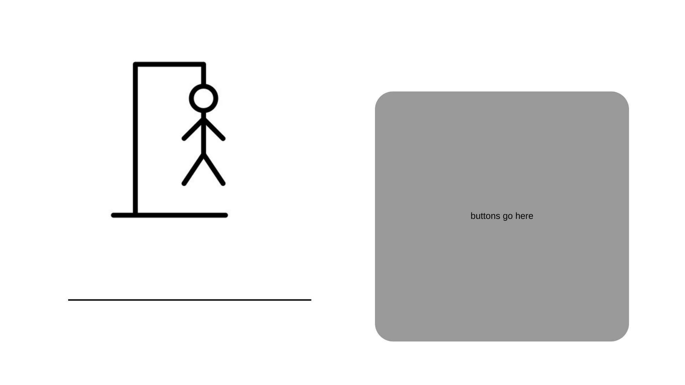

:warning: Everything between << >> needs to be replaced (remove << >> after replacing)

Hangman Binghaton University Edition
## CS110 Final Project Spring 2024

## Team Members

Eryn Asante-Wiredu

***

## Project Description

A silly game of hangman with small story aspect. After game is loaded and menuscreens are passed user can guess a randomly generated four letter word "Random word API" by Herokuapp using GUI interface buttons. Each option is selected using a click or double click, please try a clickfirst, wait, then if no response doubleclick. I also have no control over the words being used so some of them might be innapropriate. Sorry.  For entertainment purposes.

## Additional Modules
modules used:
    pygame 
        citation: Pygame. Pygame. Retrieved from https://www.pygame.org/
    os 
        citation: Python Software Foundation. os — Miscellaneous operating system interfaces. Python 3.9.6 documentation. Retrieved from https://docs.python.org/3/library/os.html
    math 
        citation: math — Mathematical functions. Python 3.9.6 documentation. Retrieved from https://docs.python.org/3/library/math.html
    requests 
        citation: Citation: Kenneth Reitz. requests: HTTP for Humans™. Retrieved from https://docs.python.org/3/library/urllib.request.html#module-urllib.request

    sys 
        citation: Citation: Python Software Foundation. sys — System-specific parameters and functions. Python 3.9.6 documentation. Retrieved from https://docs.python.org/3/library/sys.html
    random 
        citation: Citation: Python Software Foundation. random — Generate pseudo-random numbers. Python 3.9.6 documentation. Retrieved from https://docs.python.org/3/library/random.html

custom modules:
    src.classfolder.menu 
    src.classfolder.scenario
    src.classfolder.winscreen
    src.classfolder.hangmanaudio
    src.classfolder.hangmanwords
    src.classfolder.hangmanguy
    src.classfolder.losescreen

***    

## GUI Design

### Initial Design

### Final Design

## Program Design

### Features

1. start menu, win menu, lose menu
2. randomlly generated story scenario
3. interavtive GUI for hangman game with gameplay music & sound effect 
4. scoreboard that keeps track of how many games in a row were won
5. API database for hangman randomly generated

### Classes
- HangmanAudio: generates audio and game sound effect
HangmanGraphics: generates GUI buttons, hangman visual, and word visual
HangmanWords: facilitates checking if a guessed letter is correct and whether all letters in the word have been guessed
Losescreen: initiates screen for when player loses game
Menu: initiates screen for when player first starts game
ScenarioMenu: randomly generates a story scentario and iinitiates screen associated with said visual
WinScreen: initiates screen for when player wins game
Controller: coordinates the games main operations
main: program initiation

## ATP
Test Case 1: Player mouse input
Test Description: Verify that the player's mouse input progresses early menu screens.
Test Steps:
    Start the game.
    click /double click Start.
    Verify that the screen changes to the the scenario menu.
    click/double click continue.
    Verify that the screen starts the hangman game.
Expected Outcome: The player's mouse input should progress both early menu screens.
 
Test Case 2: Hangman alphabet button
Test Description: Verify that the player's letter button input progresses hangman game
Test Steps:
    Start the game.
    click/double click through both menu screens (test 1)
    click/double click one letter button.
Expected Outcome: The hangman game image should change or the letter pressed should display on GUI.

Test Case 3: Hangman win
Test Description: Verify that the hangman win screen appears after guessing all for letters in hangman word.
Test Steps:
    Start the game.
    click/double click through both menu screens (test 1)
    Use print statement as a key for which letter buttons to select and select those buttons. click/double click buttons
Expected Outcome: The win menu screen appears.

Test Case 4: Hangman lose
Test Description: Verify that the hangman lose screen appears after failing to guess all for letters in hangman word and using up all 6 tries.
Test Steps:
    Start the game.
    click/double click through both menu screens (test 1)
    Use print statement as a key for which letter buttons to select and avoid those buttons six times. click/double click buttons
Expected Outcome: The lose menu screen appears

Test Case 5: Hangman repeat
Test Description: Verify that hangmangame repeats on the lose and win menus after play again is pressed.
Test Steps:
    Start the game.
    click/double click through both menu screens (test 1)
    Use print statement as a key for which letter buttons to select and avoid those buttons six times click/double click buttons (test4)
    click/double click buttons play again 
    Get pass both menu screens (test 1)
    Use print statement as a key for which letter buttons to select and select those buttons click/double click buttons(test3)
    click/double click buttons play again
Expected Outcome: hangmangame should start 3 times with no issue.