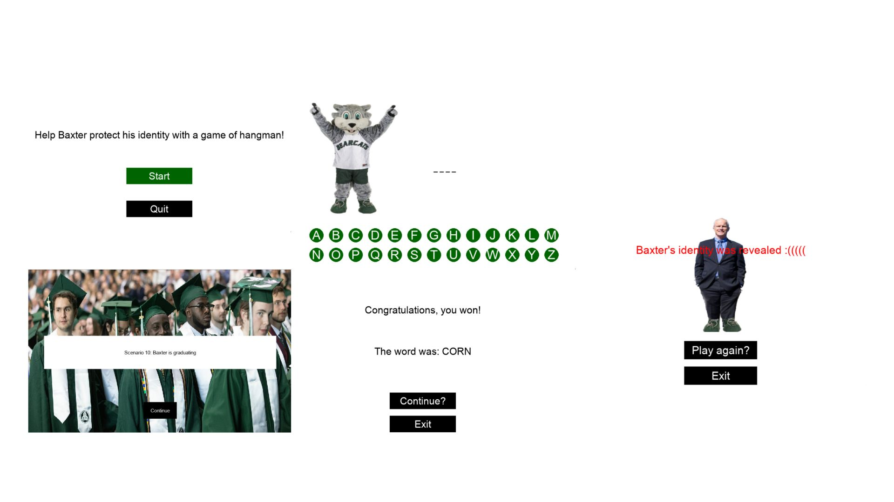

:warning: Everything between << >> needs to be replaced (remove << >> after replacing)

# << Project Title >>
## CS110 Final Project  << Semester, Year >>

## Team Members

Eryn Asante-Wiredu

***

## Project Description

App that help user take care of plants by giving user time and enviornment based notifications for the specific plants that they have added.

***    

## GUI Design

### Initial Design

### Final Design

## Program Design

### Features

1. start menu
2. additon of specifc plants and their info
3. app rpovides notifications based on whether and time data 
4. user can add their own notification schedules
5. working weather widget

### Classes

- << You should have a list of each of your classes with a description >>

## ATP

| Step                 |Procedure             |Expected Results                   |
|----------------------|:--------------------:|----------------------------------:|
|  1                   | Run Counter Program  |GUI window appears with count = 0  |
|  2                   | click count button   | display changes to count = 1      |
etc...
